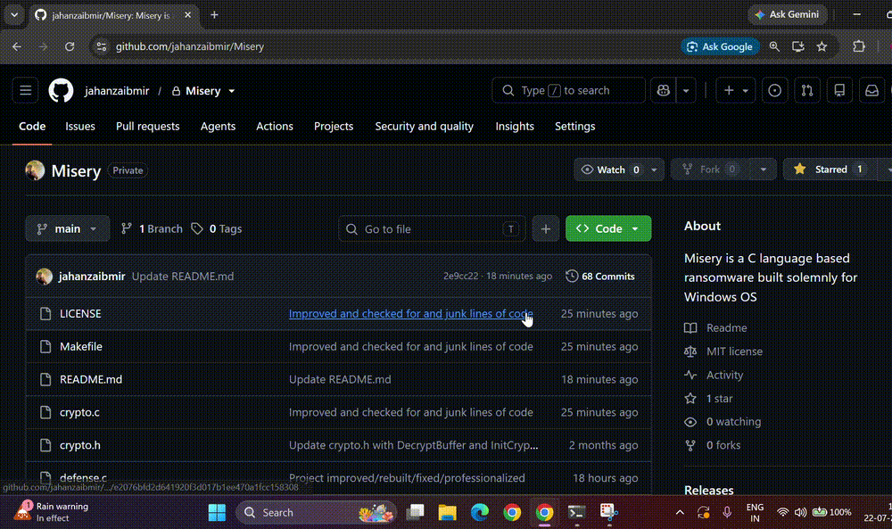

# Misery
Misery is a modular, WinOS based research ransomware created to simulate a fast and sophisticated attack. Built entirely in C, it combines heavy duty, multi threaded AES-256-CBC file encryption with active defense evasion. The project demonstrates how modern threats operate by blinding core Windows security tools like AMSI and ETW to slip past detection. To ensure the attack is effective Misery deletes system shadow backups to prevent file recovery and sets up multi layered persistence using registry hijacks and accessibility backdoors. Finally, after achieving full control over the system, the payload automatically wipes itself from the disk to make forensic analysis as difficult as possible.

## Demonstration



## Requirements

gcc

make 

# Compilation

```bash
git clone https://github.com/jahanzaibmir/Misery.git

cd Misery

make 
```

# Warning

This project is for educational and authorized security research only. Do not use it on systems you do not own or have explicit permission to test. The author is not responsible for any misuse or damage resulting from the use of this project.

# About Author

Jahanzaib Ashraf Mir 

Cybersecurity Engineer • Ethical Hacker •  Developer

Built from Scratch


